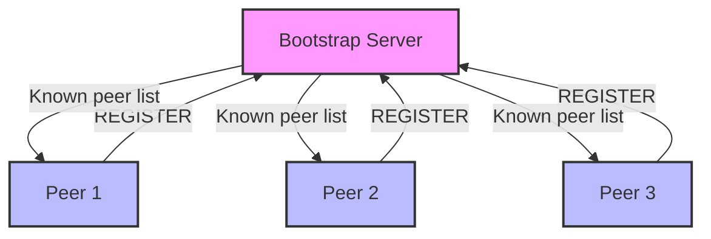
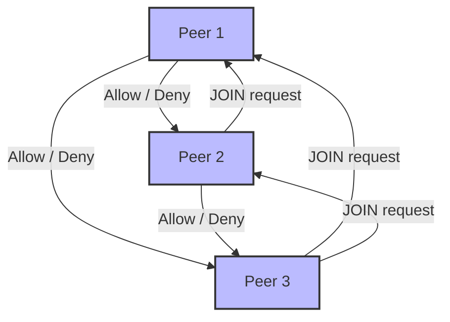
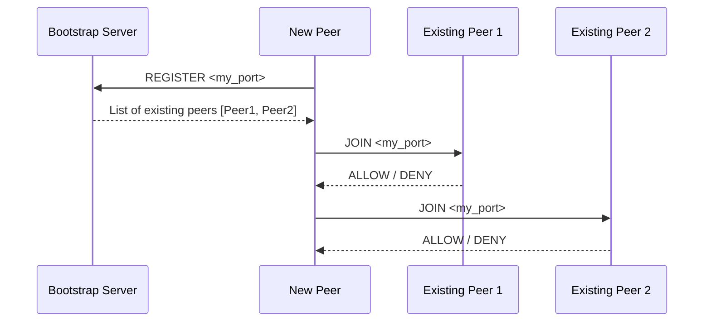
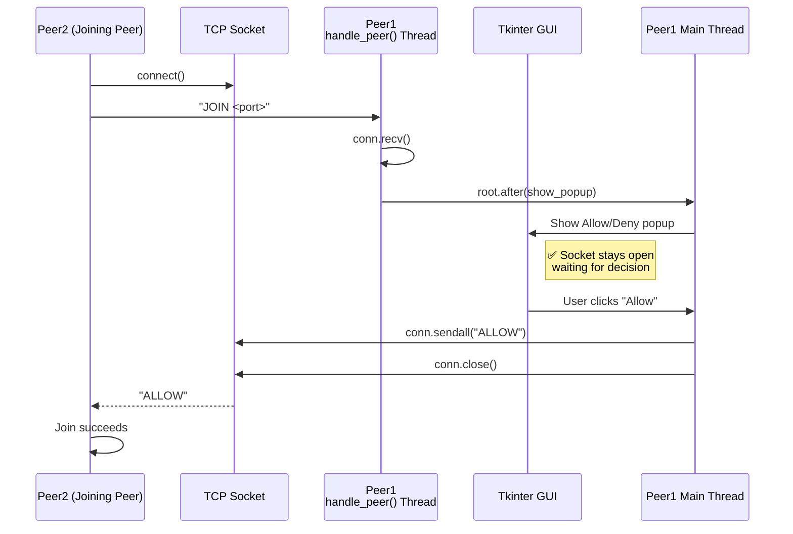

#### Architecture Diagram
##### Network Registration

##### Consensus to join peer to peer network


#### Sequence Diagram



## ✅ How to test

1. Start bootstrap:

```bash
python bootstrap.py
```

2. Start the **first peer**:

```bash
python peer.py
```

Output:
GUI Shows  
```
My peer is running on 5000
Welcome to network
```

3. Start a **second peer**:

```bash
python peer.py
```

* First peer terminal will show:

```
Allow / Deny Pop Up
```

* Type `y` → second peer sees:

```
Welcome to network
```

4. Start additional peers — all existing peers must approve.

---

## Test Result:

#### ✅ Correct Flow (Suggested Fix)  — Socket Lifetime Matches UI Decision
