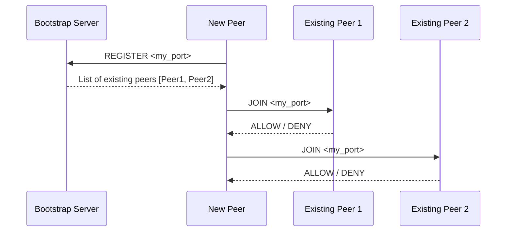
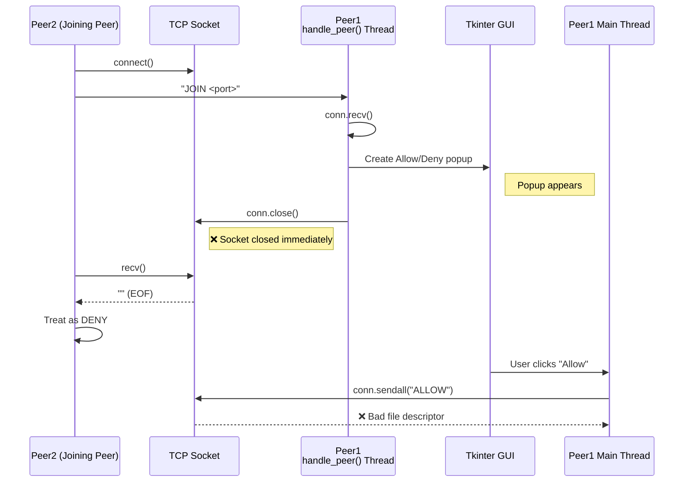
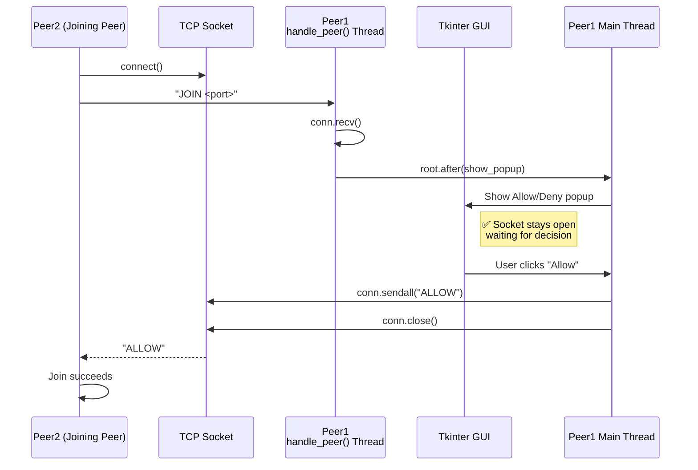

## High-level design (important first)

### Key ideas

* **Every peer runs the same program** (no special roles).
* Peers communicate using **TCP sockets** on `localhost`.
* Each peer:

  * Listens on its own port
  * Knows a list of currently connected peers
* **Consensus rule**:

  * When a new peer wants to join, **every existing peer must approve**
  * If *any* peer denies → join fails




## ✅ How to test

1. Start bootstrap:

```bash
python bootstrap.py
```

2. Start the **first peer**:

```bash
python peer.py
```

Output:

```
My peer is running on 5000
Welcome to network
```

3. Start a **second peer**:

```bash
python peer.py
```

* First peer terminal will show:

```
Join request from peer 5001
Allow this peer? (y/n):
```

* Type `y` → second peer sees:

```
Welcome to network
```

4. Start additional peers — all existing peers must approve.

---

## Test Result:

### Issue in Implementation:
  1. Peer1 port 44775 Denies Peer2 Automatically Before i press Allow/Deny
  2. When Allow button pressed Peer1 shows  
    Exception in Tkinter callback  
    Traceback (most recent call last):  
        File "/usr/lib/python3.10/tkinter/__init__.py", line 1921, in __call__  
          return self.func(*args)  
        File "/home/pc/peer-peer/peer.py", line 39, in approve  
          conn.sendall(b"ALLOW")  
      OSError: [Errno 9] Bad file descriptor  

### Expected output:
    Allow if allow button Pressed deny if deny button pressed.  

### Identified Problem in the current implementation
#### ❌ Current (Buggy) Flow — Why Auto-Deny & Bad File Descriptor Occur


#### ✅ Correct Flow (Suggested Fix)  — Socket Lifetime Matches UI Decision



## Github Experiment Beyond Syllabus: Author Raises an issue (fix the bug) Contributors raises pull Request (to include their fix) 

### High-level GitHub contribution flow (what really happens)

1. **You (repo owner) create an Issue**
2. **A contributor forks your repo**
3. **They fix the issue in their fork**
4. **They open a Pull Request (PR)**
5. **You review, request changes, or approve**
6. **You merge the PR**

That’s it — but each step has concrete actions. Let’s go through them **hands-on**.

---

### Step 1: Create a GitHub Issue (this is how you “request contributors”)

In your repository:

1. Go to **Issues** tab
2. Click **New issue**
3. Choose **Blank issue** (or a bug template if you have one)

#### What to write (very important)

Use this structure — contributors look for this:

**Title**

```
Join requests auto-deny due to socket closing before UI decision
```

**Body**

```markdown
#### Bug Description
When a peer receives a JOIN request, the connection socket is closed
before the user clicks Allow or Deny. This causes:

- Auto-denial of join requests
- `OSError: [Errno 9] Bad file descriptor` on Allow click

#### Expected Behavior
Socket should remain open until the user presses Allow or Deny.

#### Actual Behavior
`handle_peer()` closes the socket immediately after showing the popup.

#### Steps to Reproduce
1. Start bootstrap server
2. Start Peer1
3. Start Peer2
4. Peer1 auto-denies before button click

#### Possible Direction
- Socket lifetime must be tied to GUI decision
- Tkinter UI should be created on the main thread (`root.after`)

#### Files
- `peer.py`

#### Skill Level
Good first issue (threads + sockets + Tkinter)
```

Then add labels:

* `bug`
* `good first issue`
* `help wanted`

👉 **This is the signal to contributors**.

---

### Step 2: Contributors Fork Your Repo

A contributor does this:

1. Click **Fork** (top right of your repo)
2. GitHub creates a copy under their account

They now work **without touching your repo directly**.

---

### Step 3: Contributor fixes the bug locally

Typical contributor workflow (you don’t do this step):

```bash
git clone https://github.com/their-username/your-repo.git
cd your-repo
git checkout -b fix-socket-lifetime
```

They:

* Modify `peer.py`
* Test the fix
* Commit changes

```bash
git add peer.py
git commit -m "Fix join auto-deny by keeping socket open until UI decision"
git push origin fix-socket-lifetime
```

---

### Step 4: Contributor opens a Pull Request (PR)

On GitHub, they click:

> **Compare & pull request**

They fill in:

* **Title**: `Fix auto-deny join bug`
* **Description**:

```markdown
Fixes #12

- Keeps socket open until Allow/Deny
- Moves Tkinter UI creation to main thread
```

👉 `Fixes #12` automatically links and closes the issue when merged.

---

### Step 5: You review the Pull Request (your role)

You’ll see a new **Pull requests** tab.

You can:

#### ✔ Review code

* See line-by-line changes
* Add comments
* Ask for changes

#### ✔ Request changes

Example comment:

> Please ensure `conn.close()` is only called from approve/deny.

#### ✔ Approve

Click **Approve**

---

### Step 6: Merge the PR

Once approved:

* Click **Merge pull request**
* Choose:

  * **Squash and merge** (recommended for small fixes)
* Delete branch

🎉 Done — issue closed automatically.

---

### What YOU need to do right now (checklist)

✅ Create an Issue
✅ Label it correctly
✅ Be clear and reproducible
✅ Mark as beginner-friendly

That’s how you “request contributors”.

---

### Optional but VERY helpful extras

#### 1️⃣ Add a `CONTRIBUTING.md`

```markdown
### How to Contribute
1. Fork the repo
2. Create a feature branch
3. Make changes
4. Open a Pull Request
```

#### 2️⃣ Add issue templates

GitHub → Settings → Issues → Templates

#### 3️⃣ Add a diagram (your Mermaid!)

This increases contributor confidence a LOT.

---

### Common beginner misconception (important)

> ❌ “Someone will push code to my repo”

No — **nobody pushes to your repo** except you.
They always:

* fork
* PR
* you merge

---


