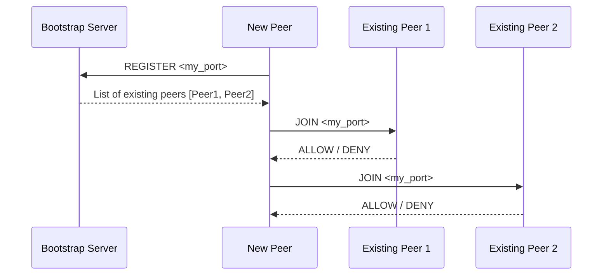

guide me how i can build a simple peer to peer application.  
requirements:
1. no peer has extra privilege
2. peer network come alive when first peer starts and he will see message "Welcome to network"
3. every next peer when joins existing peers receives a request to allow or deny new peer
4. if all existing peer allows then new peer will see message "welcome to network"

i will test this first in a single computer.

# Response from ChatGPT
Below is a **simple, concrete way to build and test a peer-to-peer (P2P) network on one computer**, while satisfying all your requirements. I’ll keep it **minimal, symmetric (no privileged peer)**, and **easy to reason about**.

---

## High-level design (important first)

### Key ideas

* **Every peer runs the same program** (no special roles).
* Peers communicate using **TCP sockets** on `localhost`.
* Each peer:

  * Listens on its own port
  * Knows a list of currently connected peers
* **Consensus rule**:

  * When a new peer wants to join, **every existing peer must approve**
  * If *any* peer denies → join fails




Perfect! I’ll give you **two separate files**: one for the bootstrap server and one for the peer. This version will **auto-assign ports**, automatically discover existing peers via the bootstrap server, and still ask all existing peers to approve a new peer. It’s fully runnable on a **single computer**.

---

## 1️⃣ `bootstrap.py` (discovery server)


This runs a simple peer discovery service. It doesn’t approve or control the network — it just tells peers who else exists.

---

## 2️⃣ `peer.py` (peer node)


## ✅ How to test

1. Start bootstrap:

```bash
python bootstrap.py
```

2. Start the **first peer**:

```bash
python peer.py
```

Output:

```
My peer is running on 5000
Welcome to network
```

3. Start a **second peer**:

```bash
python peer.py
```

* First peer terminal will show:

```
Join request from peer 5001
Allow this peer? (y/n):
```

* Type `y` → second peer sees:

```
Welcome to network
```

4. Start additional peers — all existing peers must approve.

---

This design meets your requirements:

1. No peer has extra privileges
2. First peer auto-starts network and sees "Welcome to network"
3. All existing peers approve new peers
4. New peer joins only if **all approve**

---

I can also modify this so **you don’t have to manually type “y/n”** — you could have a **default auto-approval or automated voting** for easier testing.

Do you want me to do that?


